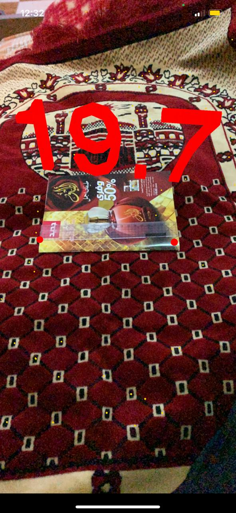

# caution (the app give you an approximate value and not always accurate)
# AR-Ruler App

## An app that uses augmented reality via camera to measure between two points that the user does when he touches the screen.

* Used Augmented Reality.
* Used a SceneKit.
* Used Maths equation so we can measure the two points in 3D.
* The user can measure many times when he touch the screen the old value will disappear.

## Here is a screenshot.

